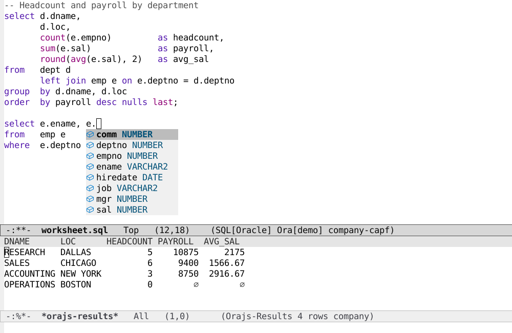

# orajs

An Emacs minor mode for connecting an `sql-mode` buffer to an Oracle database. 
It uses **vtable**, **company** and **node-oracledb** Thin mode. 




Commands are in orajs-command-map, which you bind to a prefix of your choice (`C-c o` for example). After your prefix:

  `c`  connect   
  `k`  cancel the running statement   
  `d`  disconnect   
  `o`  show DBMS_OUTPUT (and JavaScript console.log) in `*orajs-output*`

`C-c C-c` executes the statement at point.

Jump to definition (`M-.`, back with `M-,`) first looks in the tags file
if there is one, otherwise in the database.

Company complete using completion-at-point (company-capf).

## Getting Up and Running

You need to have installed Node.js 18 or later (and npm). The Oracle driver, node-oracledb, is installed by npm into `orajs-driver-directory` on first connect (or with `M-x orajs-install-driver`).

Setup:

```lisp
  (require 'orajs)
  (orajs-setup)
  (keymap-global-set "C-c o" 'orajs-command-map)
  (setq orajs-connections
        '(("mydb" :user "SCOTT" :service "mydb_low"
           :tns-admin "~/wallets/mydb")))
```

Then you go 

`M-x orajs-connect RET mydb` 


Passwords come from :password-file / :wallet-password-file if given, else
auth-source (machine = connection name, login = user, and login =
"wallet" for the wallet password), else a prompt. 


## Editing MLE (JavaScript) modules

You can open an MLE module directly from the database (`M-.`), which opens its JavaScript in `js-mode`.  Its `CREATE` statement is shown above the code. The default keybinding to edit this is `C-c C-e`. `C-c C-c` compiles; errors put point where Oracle reports them.

Saving the buffer with a `.sql` or `pls` suffix (per your auto-mode-alist) adds the `CREATE` statement to the file and makes it a valid SQL script.


## License

GNU GPL 3.0
